# uCoin to MySite

Pipeline em Python para recolher moedas do uCoin por país, transformar o catálogo num JSON simples para a app, classificar a disponibilidade com ajuda externa e importar os resultados para a Base44.

Também inclui um fluxo separado para recolher moedas prensadas do Presscoins como souvenirs, com pré-visualização local e sem escrever automaticamente no Site Base44.

```mermaid
flowchart LR
	subgraph S1["1. Abrir browser"]
		A["Chromium com CDP<br/>Cloudflare resolvido manualmente<br/><code>chromium --remote-debugging-port=9222</code>"]
	end

	subgraph S2["2. Extrair moedas do uCoin"]
		B["Lê país, páginas, períodos, imagens e URLs<br/><code>ucoin_catalog.py</code>"]
	end

	subgraph S3["3. Guardar catálogo bruto"]
		C["JSON técnico agrupado por períodos<br/><code>info/paises/continente/pais/ucoin-catalog.json</code>"]
	end

	subgraph S4["4. Preparar catálogo para IA"]
		D["Cria moedas planas com availability por preencher<br/><code>generate_resume_json.py</code>"]
	end

	subgraph S5["5. Classificar disponibilidade"]
		E["IA externa preenche availability<br/><code>app-catalog-final.json</code>"]
	end

	subgraph S6["6. Gerar outputs finais"]
		F["Catálogo da app, estatísticas e Excel<br/><code>generate_resume_json.py</code>"]
	end

	subgraph S7["7. Importar para Base44"]
		G["Cria ou atualiza Coin por country + url_ucoin<br/><code>import_base44_coins.py</code>"]
	end

	A --> B --> C --> D --> E --> F --> G

	style S1 stroke-dasharray: 8 6,stroke-width:2px
	style S2 stroke-dasharray: 8 6,stroke-width:2px
	style S3 stroke-dasharray: 8 6,stroke-width:2px
	style S4 stroke-dasharray: 8 6,stroke-width:2px
	style S5 stroke-dasharray: 8 6,stroke-width:2px
	style S6 stroke-dasharray: 8 6,stroke-width:2px
	style S7 stroke-dasharray: 8 6,stroke-width:2px
	style A width:260px,max-width:260px,min-height:95px
	style B width:260px,max-width:260px,min-height:95px
	style C width:260px,max-width:260px,min-height:95px
	style D width:260px,max-width:260px,min-height:95px
	style E width:260px,max-width:260px,min-height:95px
	style F width:260px,max-width:260px,min-height:95px
	style G width:260px,max-width:260px,min-height:95px
```



## Organização dos Catálogos

Todos os dados dos países ficam agrupados por continente:

```text
info/
└── paises/
    ├── africa/
    ├── america/
    ├── asia/
    │   └── india/
    ├── europa/
    └── oceania/
```

Os nomes das pastas usam slugs sem acentos. Quando o país já é conhecido, o continente é escolhido automaticamente. Para um país novo, usa `--continent`, por exemplo `--continent Ásia`.

Os souvenirs ficam separados das moedas normais:

```text
info/
└── souvenirs/
    └── america/
        └── eua/
            └── orlando/
                └── magic-kingdom/
                    └── 2026/
                        ├── presscoins-catalog.json
                        └── preview.html
```

## Recolher souvenirs do Presscoins

No menu principal escolhe `Souvenirs > USA > PressedCoins Disney Orlando > Recolher catálogo e criar pré-visualização` ou executa diretamente:

```bash
python3 -m scripts.presscoins_souvenirs --location "Magic Kingdom" --search 2026
```

Para recolher apenas os designs atuais do Magic Kingdom, deixa a pesquisa vazia no menu e escolhe `Atuais / disponíveis`, ou executa:

```bash
python3 -m scripts.presscoins_souvenirs --location "Magic Kingdom" --availability 1
```

O seletor de disponibilidade tem três opções e guarda cada âmbito separadamente:

- `Atuais / disponíveis` (`--availability 1`) → pasta `atuais`;
- `Todos os designs` (`--availability All`) → pasta `todas`;
- `Retirados` (`--availability 0`) → pasta `retiradas`.

Para recolher todos os designs, incluindo os retirados:

```bash
python3 -m scripts.presscoins_souvenirs --location "Magic Kingdom" --availability All
```

O scraper deteta e percorre automaticamente todas as páginas dos resultados. Para evitar uma recolha acidentalmente ilimitada, existe um limite de segurança configurável através de `--max-pages`.

O fluxo recolhe os dados apresentados na pesquisa, usa o URL da fotografia grande do Presscoins em `image_front` e gera:

- `presscoins-catalog.json`: dados de origem e payload `Souvenir` pendente;
- `preview.html`: grelha visual para confirmar nomes, locais e fotografias.

O catálogo fica com `status: pending_review` e `base44_updated: false`. Esta etapa não descarrega as imagens nem escreve no Site Base44. As fotografias continuam referenciadas pelo URL de origem para poderem ser tratadas por um fluxo externo depois da revisão.

Depois da revisão, o mesmo menu permite:

1. `Verificar o que falta no Site Base44`: consulta os souvenirs existentes e apresenta quantos já existem e quantos seriam criados, sem escrever nada;
2. `Importar apenas souvenirs em falta`: repete o plano, pede confirmação explícita e cria exclusivamente os registos ainda inexistentes.

As ações de revisão, verificação e importação permitem escolher entre um
catálogo específico e o modo geral. O modo geral de revisão percorre todos os
catálogos PennyCollector e Presscoins em `info/souvenirs`, retoma as decisões já
guardadas e gera o respetivo ficheiro `*-catalog-final.json`. O modo geral de
verificação/importação usa exclusivamente esses ficheiros finais completamente
aprovados. Entradas repetidas entre catálogos são consideradas uma única vez.

Também podes executar estas duas etapas diretamente:

```bash
# Apenas verificar
python3 -m scripts.import_base44_souvenirs \
  --input info/souvenirs/america/eua/orlando/magic-kingdom/atuais/presscoins-catalog.json

# Criar os que faltam, com confirmação interativa
python3 -m scripts.import_base44_souvenirs \
  --input info/souvenirs/america/eua/orlando/magic-kingdom/atuais/presscoins-catalog.json \
  --apply

# Verificar todos os catálogos importáveis de souvenirs
python3 -m scripts.import_base44_souvenirs \
  --all-catalogs --root info/souvenirs

# Importar todos os aprovados que ainda faltam, com confirmação interativa
python3 -m scripts.import_base44_souvenirs \
  --all-catalogs --root info/souvenirs --apply
```

A associação usa primeiro o número de catálogo Presscoins, depois `reference_url` e por fim país, cidade, localização e nome. Não são atualizados nem eliminados souvenirs existentes. Após a criação, o script volta a consultar o Site Base44 e verifica todos os novos registos.

## Fluxo Rápido

1. **Abrir o Chromium em modo CDP e entrar no uCoin.**

```bash
chromium --remote-debugging-port=9222 --user-data-dir=/tmp/ucoin-human-session
```

Na janela aberta, entra no uCoin e resolve o Cloudflare manualmente.

2. **Executar o pipeline do uCoin até aos ficheiros finais.**

```bash
python3 -m scripts.ucoin_pipeline India --start-year 1957 --attach-cdp --manual-session
```

Este comando cobre os pontos 2 a 6 do diagrama: extrai moedas, guarda `ucoin-catalog.json`, gera `app-catalog-pending.json`, espera pelo `app-catalog-final.json` e cria:

- `info/paises/asia/india/app-catalog.json`
- `info/paises/asia/india/availability-statistics.json`
- `info/paises/asia/india/coins-availability.xlsx`

Se quiseres parar depois de gerar o ficheiro para a IA:

```bash
python3 -m scripts.ucoin_pipeline India --start-year 1957 --attach-cdp --manual-session --no-wait-for-final
```

3. **Validar o payload antes de escrever na Base44.**

```bash
python3 -m scripts.import_base44_coins --input info/paises/asia/india/app-catalog.json --continent Ásia --dry-run
```

4. **Importar para a Base44 sem criar duplicados.**

Confirma que o `.env` tem `BASE44_APP_ID` e `BASE44_API_KEY`, depois corre:

```bash
python3 -m scripts.import_base44_coins --input info/paises/asia/india/app-catalog.json --continent Ásia --create-only --missing-only --batch-size 2 --request-delay 3 --rate-limit-delay 60 --max-retries 6
```

Este comando adiciona apenas moedas que ainda não existem para esse país, usando `country + url_ucoin` para evitar duplicados.

## Adicionar países da API sem catálogo local

O menu principal inclui `Moedas normais > Recolher países do Site sem tracking local`.
Este fluxo:

1. Consulta todas as moedas da Base44 sem alterar dados.
2. Identifica países que ainda não têm catálogo final nem `app-catalog-pending.json` já recolhido.
3. Mostra quantidade de moedas, primeiro e último ano, moeda(s) mais recente(s), alias do uCoin e pasta de destino.
4. Permite escolher todos os países ou apenas alguns números da lista.
5. Mostra os comandos completos e pede uma única confirmação antes de começar.
6. Cria `ucoin-catalog.json` e `app-catalog-pending.json`.
7. Prepara um único lote, espera pela classificação das raridades e gera os outputs finais de todos os países.
8. Apaga os ficheiros intermédios apenas depois de validar e gerar todos os outputs finais; não importa nada para a Base44.

Para ver apenas o plano, sem abrir o browser nem criar ficheiros:

```bash
python3 -m scripts.plan_missing_country_tracking
```

O ano inicial sugerido é o primeiro ano já coberto pela API. Isto evita perder séries que começaram há vários anos mas continuam a receber novas emissões. Durante a espera pela classificação, o check global apresenta esses países como `recolhidos ainda sem raridade` e não volta a sugerir o mesmo scrape.

## Classificar todas as raridades pendentes

O menu `Moedas normais > Recolher países do Site sem tracking local` prepara um único lote com todas as moedas ainda sem raridade depois de terminar a recolha:

- `info/paises/all-rarities-pending.json`: JSON que deve ser classificado;
- `info/paises/all-rarities-prompt.txt`: instruções prontas para enviar juntamente com o JSON;
- `info/paises/all-rarities-final.json`: local onde deve ser guardada a resposta completa.

O menu espera pelo ficheiro final e, depois de carregares Enter, valida que todos os países e moedas continuam presentes e que os catálogos de origem não mudaram. Apenas os valores de `availability` são aplicados. Para cada país são então gerados `app-catalog.json`, `availability-statistics.json` e `coins-availability.xlsx`. Tal como no pipeline completo de um país, `ucoin-catalog.json`, `app-catalog-pending.json`, `app-catalog-final.json` e `differences-pending.json` são apagados apenas depois de todos os outputs finais terem sido gerados com sucesso.

Para executar apenas esta classificação sem voltar a recolher os países, usa `Moedas normais > Executar uma etapa específica > Definir raridades e gerar outputs finais`. Aí podes escolher todos os países pendentes ou apenas um país específico.

Também podes executar as duas fases manualmente:

```bash
python3 -m scripts.manage_pending_rarities
python3 -m scripts.manage_pending_rarities --final-input info/paises/all-rarities-final.json --cleanup-intermediate
```

Os ficheiros globais `all-rarities-pending.json`, `all-rarities-final.json` e `all-rarities-prompt.txt` também são removidos depois da conclusão. Esta etapa não importa nem altera dados na Base44.

## 1. Abrir Browser

O uCoin pode bloquear pedidos automáticos com Cloudflare. Por isso, o scraper usa um browser real via CDP.

Abre Chromium/Chrome com debug remoto:

```bash
chromium --remote-debugging-port=9222 --user-data-dir=/tmp/ucoin-human-session
```

Nessa janela, abre o uCoin e resolve o Cloudflare manualmente. Depois deixa a janela aberta: o scraper vai ligar-se a essa sessão quando usares `--attach-cdp`.

Em alternativa, pede ao scraper para abrir automaticamente uma janela temporaria sem cookies nem login guardados:

```bash
python3 -m scripts.ucoin_catalog India --incognito --manual-session --json
```

O modo incognito pode evitar uma sessao/cookie bloqueado, mas nao muda o IP publico. Se o bloqueio for mesmo do IP, sera necessario usar outra rede ou aguardar antes de tentar de novo.

## 2. Extrair Moedas do uCoin

O script `ucoin_catalog.py` recolhe o catálogo técnico do uCoin. Ele percorre as páginas de paginação, agrupa moedas por período histórico e guarda imagens, URLs, anos, avisos de parsing e metadados de paginação.

Exemplo:

```bash
python3 -m scripts.ucoin_catalog India --start-year 1957 --attach-cdp --manual-session --json
```

### Filtro por ano inicial

Usa `--start-year` para manter apenas moedas cujo período de emissão começa nesse ano ou depois:

```bash
python3 -m scripts.ucoin_catalog India --start-year 1957 --attach-cdp --manual-session --json
```

Exemplos com `--start-year 1957`:

- `1957-2020` entra
- `1958-2000` entra
- `1943-1957` fica fora

Depois de encontrar um período sem moedas que cumpram o filtro, o scraper tenta no máximo mais dois períodos. Se esses também não tiverem moedas válidas, para o crawl para evitar percorrer páginas antigas desnecessárias.

## 3. Guardar Catálogo Bruto

O resultado do scrape é guardado como JSON técnico. Este ficheiro ainda não é o formato final da app: ele mantém a estrutura completa vinda do uCoin, incluindo períodos históricos, moedas, imagens, URLs, avisos e paginação.

Output principal:

```text
info/paises/asia/india/ucoin-catalog.json
```

A pasta de output segue `info/paises/<continente>/<pais>/`. Por exemplo, `India` e `Índia` geram `info/paises/asia/india/`.

## 4. Preparar Catálogo Para a IA

O script `generate_resume_json.py` transforma o catálogo técnico num JSON simples, com moedas planas e um campo `availability` ainda por preencher.

```bash
python3 -m scripts.generate_resume_json --input info/paises/asia/india/ucoin-catalog.json --wait-for-final
```

Output inicial:

```text
info/paises/asia/india/app-catalog-pending.json
```

Cada moeda fica com:

```json
"availability": "still needed to calculate"
```

Com `--wait-for-final`, o script cria `info/paises/asia/india/app-catalog-final.json` vazio se ainda não existir e fica à espera. Cola nesse ficheiro o JSON devolvido pela IA externa e carrega Enter no terminal.

## 5. Classificar Disponibilidade

Usa este prompt para pedir à IA externa que preencha o campo `availability` no `app-catalog-pending.json`:

```text
Vou enviar um JSON de catalogo de moedas. Quero que devolvas o mesmo JSON, preservando exatamente a mesma estrutura, a mesma ordem dos arrays e todos os campos existentes.

Tarefa: substituir apenas os valores do campo "availability" que estao como "still needed to calculate".

Valores permitidos para "availability":
- "circulating": moeda ainda em circulacao normal ou facilmente encontrada em troco/uso comum.
- "scarce": moeda valida ou recente, mas rara, comemorativa, pouco circulante ou dificil de encontrar em uso comum.
- "withdrawn": moeda do sistema monetario atual ou moderno, mas retirada/descontinuada e ja nao usada normalmente.
- "historical": moeda de um sistema monetario historico, periodo politico antigo, entidade extinta, colonia, territorio antigo, ou moeda anterior a uma grande reforma monetaria.

Regras obrigatorias:
- Nao alteres nomes de campos.
- Nao removas campos.
- Nao adiciones campos.
- Nao mudes URLs, imagens, denominacoes, anos ou periodos.
- Nao agrupes nem reordenes moedas.
- Nao escrevas explicacoes fora do JSON.
- Devolve apenas JSON valido.
- Se nao tiveres certeza, usa o melhor valor provavel com base no pais, periodo historico, anos da moeda e denominacao.

JSON:
<colar aqui o conteudo completo de info/paises/asia/india/app-catalog-pending.json>
```

O ficheiro `app-catalog-final.json` é input temporário: deve conter a resposta da IA com `availability` preenchido. Ele não é igual ao catálogo final da app.

Se fechares o terminal antes de carregar Enter, podes terminar depois com:

```bash
python3 -m scripts.generate_resume_json --input info/paises/asia/india/ucoin-catalog.json --final-input info/paises/asia/india/app-catalog-final.json
```

## 6. Gerar Outputs Finais

Depois de ler `app-catalog-final.json`, o script gera três ficheiros finais:

- `app-catalog.json`: catálogo limpo para a app
- `availability-statistics.json`: estatísticas por disponibilidade
- `coins-availability.xlsx`: Excel simples e filtrável

Exemplo para terminar manualmente:

```bash
python3 -m scripts.generate_resume_json --input info/paises/asia/india/ucoin-catalog.json --final-input info/paises/asia/india/app-catalog-final.json
```

## 7. Importar Para Base44

O importador `import_base44_coins.py` envia o `app-catalog.json` para a entidade `Coin` da Base44.

Guarda as credenciais num ficheiro `.env` local:

```bash
BASE44_APP_ID=...
BASE44_API_KEY=...
```

Confirma primeiro o payload sem escrever nada na app:

```bash
python3 -m scripts.import_base44_coins --input info/paises/asia/india/app-catalog.json --continent Ásia --dry-run
```

Para criar ou atualizar apenas uma moeda de teste:

```bash
python3 -m scripts.import_base44_coins --input info/paises/asia/india/app-catalog.json --continent Ásia --create-only --limit 1
```

Para adicionar apenas moedas que faltam, sem apagar nada, e com pausas para evitar rate limit:

```bash
python3 -m scripts.import_base44_coins --input info/paises/asia/india/app-catalog.json --continent Ásia --create-only --missing-only --batch-size 2 --request-delay 3 --rate-limit-delay 60 --max-retries 6
```

Para substituir todas as moedas desse país na entidade `Coin`:

```bash
python3 -m scripts.import_base44_coins --input info/paises/asia/india/app-catalog.json --continent Ásia --replace
```

O `--replace` apaga apenas registos `Coin` com `country` igual ao país do JSON e recria as moedas a partir do ficheiro final.

### Mapeamento Base44

O importador envia objetos neste formato:

```json
{
	"name": "1 naya paisa",
	"country": "Índia",
	"continent": "Ásia",
	"years": "1957-1961",
	"condition": "Não Tenho",
	"rarity": "Retirada",
	"has_variants": false,
	"image_frente": "https://i.ucoin.net/coin/83/867/83867628-1s/india-1-naya-paisa-1961.jpg",
	"image_verso": "https://i.ucoin.net/coin/83/867/83867628-2s/india-1-naya-paisa-1961.jpg",
	"url_ucoin": "https://pt.ucoin.net/coin/india-1-naya-paisa-1957-1961/?tid=15326",
	"url_numista": "",
	"notes": "República da Índia",
	"ordem": 1
}
```

Conversão de disponibilidade para raridade:

- `circulating` -> `Circulante`
- `scarce` -> `Escassa`
- `withdrawn` -> `Retirada`
- `historical` -> `Histórica`

O campo `name` fica apenas com a denominação da moeda. O campo `years` guarda o período de emissão. O campo `notes` guarda o período histórico limpo. O link original do uCoin fica em `url_ucoin`.

Campos como `url_numista`, `local_compra`, `valor_pago`, `moeda_valor`, `adquirida_por` e `data_aquisicao` ficam vazios no import inicial, porque são dados da tua coleção e não do catálogo uCoin.

Como `name` não é único, moedas com a mesma denominação e anos diferentes são distinguidas por `country + url_ucoin`.

## Ficheiros Principais

- `scripts/ucoin_pipeline.py`: comando que encadeia scrape, geração do pending e finalização
- `scripts/ucoin_catalog.py`: scraper do catálogo do uCoin
- `scripts/generate_resume_json.py`: wrapper para gerar o catálogo simplificado
- `scripts/import_base44_coins.py`: importador Python para a Base44
- `ucoin_to_mysite/`: implementação interna
- `tests/`: testes automatizados
- `info/paises/<continente>/<pais>/ucoin-catalog.json`: catálogo técnico vindo do uCoin
- `info/paises/<continente>/<pais>/app-catalog-pending.json`: catálogo para enviar à IA externa
- `info/paises/<continente>/<pais>/app-catalog-final.json`: resposta da IA externa
- `info/paises/<continente>/<pais>/app-catalog.json`: catálogo final para a app
- `info/paises/<continente>/<pais>/availability-statistics.json`: estatísticas finais
- `info/paises/<continente>/<pais>/coins-availability.xlsx`: Excel final

## Nota Cloudflare

Se o resultado vier com `title = Just a moment...` e `count = 0`, o Cloudflare bloqueou a extração dessa tentativa. Resolve o challenge na janela do Chromium e volta a correr o comando com `--attach-cdp --manual-session`.
